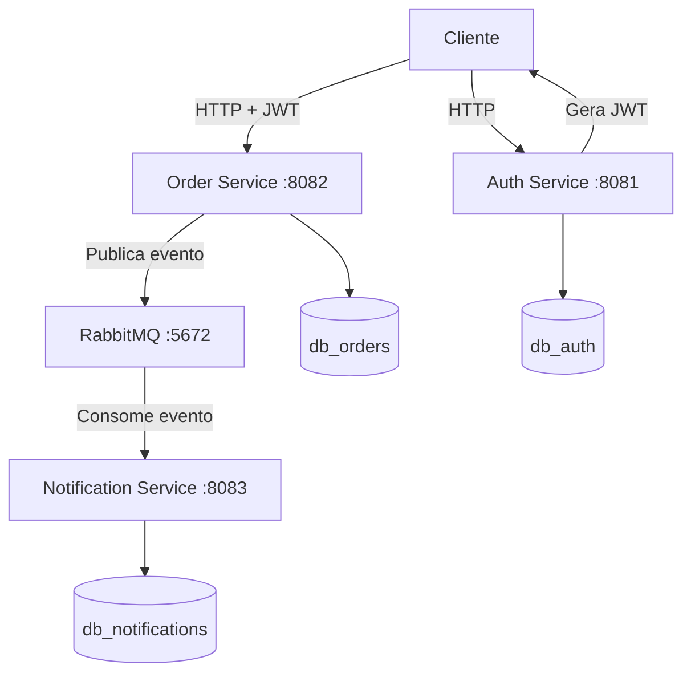
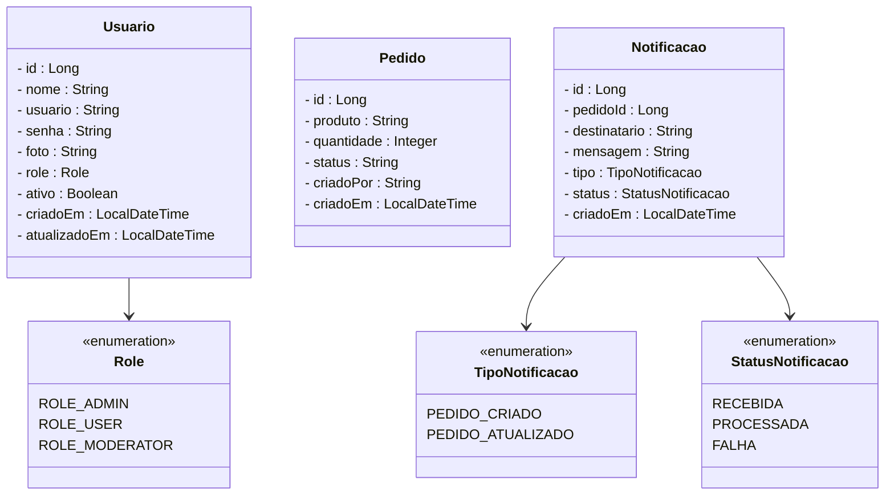
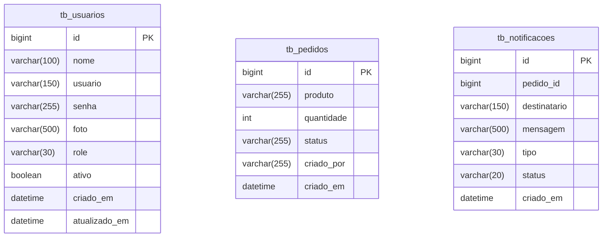
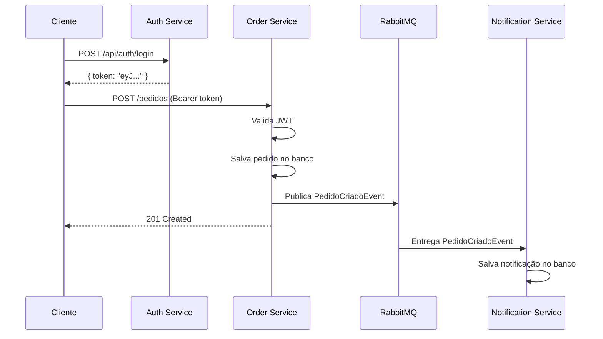

# Projeto Microsserviços de Pedidos - Backend com Spring Boot

<br />

<div align="center">
     
</div>

<br />

<div align="center">
  
  
  
  
  
  
  

</div>

<br />

## 1. Descrição

<br />

O **Microsserviços de Pedidos** é um sistema distribuído desenvolvido com **Java** e **Spring Boot**, composto por três microsserviços independentes que se comunicam de forma assíncrona via **RabbitMQ**. Cada serviço possui sua própria responsabilidade, banco de dados e ciclo de vida, seguindo os princípios de arquitetura de microsserviços.

Este projeto foi desenvolvido com fins de estudo e prática de conceitos como mensageria, autenticação JWT, segurança com Spring Security e comunicação assíncrona entre serviços.

<br />

## 2. Arquitetura

<br />



<br />

## 3. Microsserviços

<br />

### 3.1. Auth Service — porta 8081

Responsável pelo cadastro de usuários, autenticação e emissão de tokens JWT. É o ponto de entrada para qualquer cliente que precise se autenticar no sistema.

**Principais funcionalidades:**

- Cadastro de usuários com roles (`ROLE_ADMIN`, `ROLE_USER`, `ROLE_MODERATOR`)
- Login com validação de credenciais via Spring Security
- Geração e validação de tokens JWT
- Gerenciamento de usuários (CRUD)

**Endpoints principais:**

| Método | Endpoint          | Descrição                           | Auth    |
| ------ | ----------------- | ----------------------------------- | ------- |
| POST   | `/api/auth/login` | Realiza login e retorna o token JWT | ❌       |
| POST   | `/usuarios`       | Cadastra um novo usuário            | ❌       |
| GET    | `/usuarios`       | Lista todos os usuários             | ✅       |
| GET    | `/usuarios/{id}`  | Busca usuário por ID                | ✅       |
| PUT    | `/usuarios/{id}`  | Atualiza dados do usuário           | ✅ ADMIN |
| DELETE | `/usuarios/{id}`  | Remove um usuário                   | ✅ ADMIN |

<br />

### 3.2. Order Service — porta 8082

Responsável pelo gerenciamento de pedidos. Valida o token JWT emitido pelo Auth Service e publica eventos no RabbitMQ sempre que um pedido é criado ou atualizado.

**Principais funcionalidades:**

- CRUD de pedidos com proteção por JWT
- Publicação de eventos `PedidoCriadoEvent` e `PedidoAtualizadoEvent` no RabbitMQ
- Filtragem de pedidos por criador

**Endpoints principais:**

| Método | Endpoint                     | Descrição                 | Auth |
| ------ | ---------------------------- | ------------------------- | ---- |
| GET    | `/pedidos`                   | Lista todos os pedidos    | ✅    |
| GET    | `/pedidos/{id}`              | Busca pedido por ID       | ✅    |
| GET    | `/pedidos/criador/{criador}` | Lista pedidos por criador | ✅    |
| POST   | `/pedidos`                   | Cria um novo pedido       | ✅    |
| PUT    | `/pedidos`                   | Atualiza um pedido        | ✅    |
| DELETE | `/pedidos/{id}`              | Remove um pedido          | ✅    |

<br />

### 3.3. Notification Service — porta 8083

Responsável por consumir os eventos publicados pelo Order Service no RabbitMQ e registrar notificações no banco de dados. Não expõe endpoints de escrita — apenas consome eventos e disponibiliza consultas.

**Principais funcionalidades:**

- Consumo de `PedidoCriadoEvent` e `PedidoAtualizadoEvent` via RabbitMQ
- Registro de notificações com tipo (`PEDIDO_CRIADO`, `PEDIDO_ATUALIZADO`) e status (`PROCESSADA`, `FALHA`)
- Consulta de notificações por destinatário

**Endpoints principais:**

| Método | Endpoint                            | Descrição                   | Auth |
| ------ | ----------------------------------- | --------------------------- | ---- |
| GET    | `/notificacoes`                     | Lista todas as notificações | ✅    |
| GET    | `/notificacoes/{id}`                | Busca notificação por ID    | ✅    |
| GET    | `/notificacoes/destinatario/{dest}` | Lista por destinatário      | ✅    |

<br />

## 4. Diagrama de Classes

<br />



<br />

## 5. Diagrama Entidade-Relacionamento

<br />



<br />

## 6. Fluxo de Comunicação

<br />



<br />

## 7. Tecnologias Utilizadas

<br />

| Item                | Descrição                           |
| ------------------- | ----------------------------------- |
| **Linguagem**       | Java 21                             |
| **Framework**       | Spring Boot 4.0.6                   |
| **Segurança**       | Spring Security + JWT (jjwt 0.12.5) |
| **Mensageria**      | RabbitMQ 3.13                       |
| **ORM**             | Spring Data JPA + Hibernate         |
| **Banco de dados**  | MySQL 8.0                           |
| **Servidor**        | Tomcat (embutido)                   |
| **Containerização** | Docker + Docker Compose             |

<br />

## 8. Requisitos

<br />

- [Java JDK 25+](https://www.oracle.com/java/technologies/downloads/)
- [Maven 3.9+](https://maven.apache.org/download.cgi)
- [Docker + Docker Compose](https://www.docker.com/)
- [MySQL 8.0+](https://dev.mysql.com/downloads/) ou via Docker
- [Postman](https://www.postman.com/) ou [Insomnia](https://insomnia.rest/download)

<br />

## 9. Como Executar

<br />

### 9.1. Subindo o RabbitMQ

Na raiz do projeto, execute:

```bash
docker compose up -d
```

Acesse o painel de gerenciamento em `http://localhost:15672` com as credenciais configuradas no `docker-compose.yml`.

<br />

### 9.2. Configurando o banco de dados

Crie os databases no MySQL:

```sql
CREATE DATABASE db_auth;
CREATE DATABASE db_orders;
CREATE DATABASE db_notifications;
```

<br />

### 9.3. Executando os serviços

Abra um terminal para cada serviço e execute na seguinte ordem:

```bash
# Terminal 1 — Auth Service
cd auth-service
mvn spring-boot:run

# Terminal 2 — Order Service
cd order-service
mvn spring-boot:run

# Terminal 3 — Notification Service
cd notification-service
mvn spring-boot:run
```

<br />

### 9.4. Testando o fluxo completo

```bash
# 1. Login
curl -s -X POST http://localhost:8081/usuarios/logar \
  -H "Content-Type: application/json" \
  -d '{"usuario":"seu@email.com","senha":"senha123"}'

# 2. Criar pedido (substitua <TOKEN> pelo token retornado)
curl -s -X POST http://localhost:8082/pedidos \
  -H "Content-Type: application/json" \
  -H "Authorization: Bearer <TOKEN>" \
  -d '{"produto":"Notebook","quantidade":2}'

# 3. Verificar notificação gerada
curl -s http://localhost:8083/notificacoes
```

<br />

## 10. Estrutura do Projeto

<br />

```
microservicos-pedidos/
├── docker-compose.yml
├── auth-service/
│   ├── src/main/java/com/rfl/auth_service/
│   │   ├── config/
│   │   ├── controller/
│   │   ├── dto/
│   │   ├── enums/
│   │   ├── exception/
│   │   ├── model/
│   │   ├── repository/
│   │   ├── security/
│   │   └── service/
│   └── src/main/resources/application.properties
├── order-service/
│   ├── src/main/java/com/rfl/order_service/
│   │   ├── config/
│   │   ├── controller/
│   │   ├── dto/
│   │   ├── event/
│   │   ├── exception/
│   │   ├── model/
│   │   ├── repository/
│   │   ├── security/
│   │   └── service/
│   └── src/main/resources/application.properties
└── notification-service/
    ├── src/main/java/com/rfl/notification_service/
    │   ├── config/
    │   ├── consumer/
    │   ├── controller/
    │   ├── dto/
    │   ├── enums/
    │   ├── event/
    │   ├── exception/
    │   ├── model/
    │   ├── repository/
    │   └── service/
    └── src/main/resources/application.properties
```

<br />

## 11. Contribuição

<br />

Este repositório é parte de um projeto de estudos, mas contribuições são bem-vindas! Caso tenha sugestões, correções ou melhorias, fique à vontade para:

- Criar uma **issue**
- Enviar um **pull request**

<br />

## 12. Contato

<br />

Para dúvidas, sugestões ou colaborações, abra uma issue no repositório.